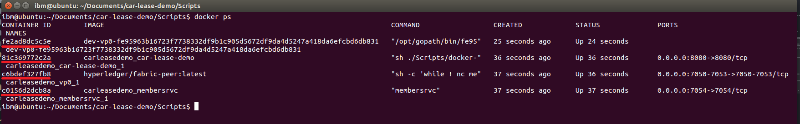
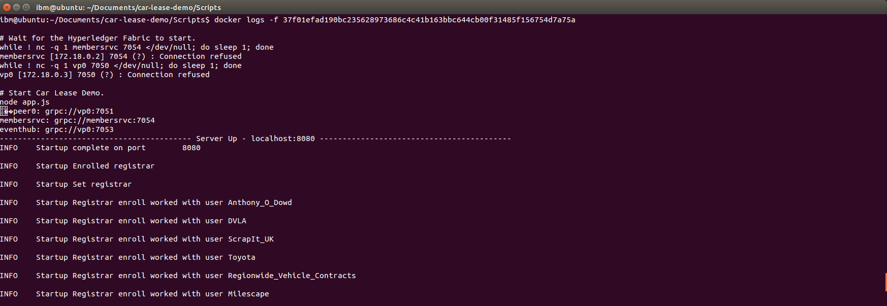

Installation Guide
=======
## Deploying to Bluemix ##
To deploy to Bluemix simply use the button below then follow the instructions. This will generate the NodeJS server and the Blockchain service for you.

## Deploying Locally ##

### Prerequisites ###
To deploy locally you will need to have installed:

 - [NodeJS v6.x](https://nodejs.org/en/download/)
 - [npm](https://docs.npmjs.com/getting-started/installing-node)
 - [Git](https://git-scm.com/download)
 - [Docker](https://docs.docker.com/engine/installation/linux/ubuntulinux/)

### Cloning the repository ###
Open up a terminal or command window where you wish to have the app then run:

    git clone https://github.com/IBM-Blockchain/car-lease-demo.git

### Installing npm required modules ###
The application makes use of a number of modules developed externally that must be installed to run. To do this open a terminal or command window in the car-lease-demo folder and run the command:

    npm install

### Updating the configurations file ###

When deploying locally the following settings need to be changed in the configuration.js file:

`config.networkProtocol = 'http';`

`config.appProtocol = 'http';`

`config.hfcProtocol = 'grpc';`

More information on the configuration file can be found in [Server Side.md](./Server%20Side.md)

#### Connecting to a non-default NodeJS server ####

The NodeJS server by default runs on localhost:8080. If you are running in a different location then in `Server_Side/configurations/configuration.js`
change the `app_url` variable to be the url of where the app server should run including the port. You will also need to change `appPort` to be the port
for the NodeJS server.

#### Connecting to a non-default setup local peer ####
The configurations file by default is set up to use a local peer set up using the HyperLedger fabric default settings e.g. IP of 127.0.0.1, api_port:7050 and discovery_port:7051.
If your local peer uses different settings then the following will need to be changed in `credentials.json` under 'peer':

- `discovery_host` to be the host of the peer which is the starting point for discovering all peers on the network
- `discovery_port` to be the port of the peer which is the starting point of the discovery process
- `api_host` to be the host the peer
- `api_port` to be the port of the peers rest API
- `event_host` to be the host of the event hub
- `event_port` to be the port of the event hub

If your local member service uses different settings then the following will also need to be changed in `credentials.json` under 'ca':

- `discovery_host` to be the host of the membersrvc used for discovery
- `discovery_port` to be the port of the membersrvc used for discovery

A backup of credential required for local deployment can be found in `local-credentials.json`

#### Connecting to an external Bluemix Peer ####
To connect to an external Bluemix peer, copy the services VCAP variables into `credentials.json`
These VCAP variables can be found in a Bluemix service under 'Service Credentials' as shown below.

### Running the application ###
To start the application, change your current working directory to `Scripts`. Then run the `start.sh` script in a terminal or command prompt window using:

    ./start.sh
  *Note: You may have to give the script permissions first by running chmod u+x ./start.sh

You can then view it by opening your browser to where you have NodeJS running. By default it will load on http://localhost:8080.

### Retrieving Logs ###
Assuming you're running locally, peer logs can be retrieved from Docker containers.
Once the start.sh script has finished running the following commands can be ran from within a terminal:

`docker ps` (This will show all running docker containers)
*Note: There should be 4 docker containers:
       - Chaincode container
       - Application container
       - Peer container
       - Membersrvc container

`docker logs -f DOCKER_ID` (This will show all logging where DOCKER_ID is replaced with a Docker container ID)
*Note: To find the full Docker container ID, start to type the container ID then press 'TAB' to autocomplete in the terminal

