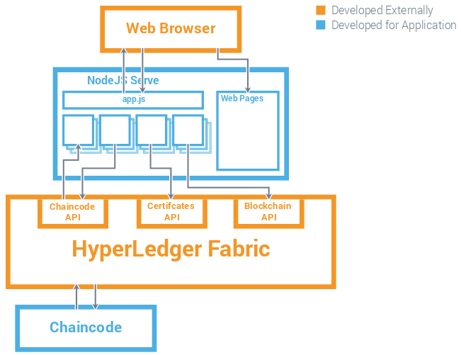

# Car Leasing Demo

# Application Background

This application demonstrates the lifecycle of a vehicle from creation to manufacture, through a series of owners and finsishing with the vehicle being scrapped. The demo makes use of Node.js for the server side programming with GoLang used for the chaincode running on the IBM Blockchain network. The demo has two chaincodes, the first defines the rules about what can and can't happen to a vehicle (similar to a v5c) and the second stores a log of what has happened to a vehicle during its lifetime. Both chaincodes use JSON objects to store their data.

Attributes of a vehicle:

	1. V5cID            (unique string formed of two chars followed by a 7 digit int, used as the key to identify the vehicle)
	2. VIN              (15 digit int)
	3. Make             (String)
	4. Model            (String)
	5. Colour           (String)
	6. Reg              (String)
	7. Owner            (Ecert of user)
	8. Scrapped         (Bool)
	9. Status           (int)
	10. LeaseContractID (ChaincodeID, currently unused but will store the address of the lease contract for the vehicle)
  
Attributes of a log:

	1. Name             (String, The name of the log type e.g. Create, Transfer, Update)
	2. Time             (String, UTC timestamp of when the log was made)
	3. Text             (String, The message to go with the log)
	4. Obj_ID           (String, Unique identifier of the object the log refers to e.g. the V5cID)
	5. Users            (Array of Ecerts, Array of the users involved with the log)

We have built an API ([Documentation](/Documentation/API Methods.txt)) that the client side uses to call the Node.js server. The node.js server then uses HTTP REST calls to contact a peer on the IBM Blockchain network to call our chaincode/communicate with the blockchain.

# Application Architecture

We use a 3 tier architecture to create the demo. There is a Node JS server which serves the web pages to the browser and also acts as the appliaction server. The application server then interacts with the blockchain through the IBM Blockchain API. Below is a diagram of the application architecture:

# Use Case Walthrough

## Transfer of Ownership ##

When a user sells their car the owner must be updated. Below is the sequence diagram for that process:

  
