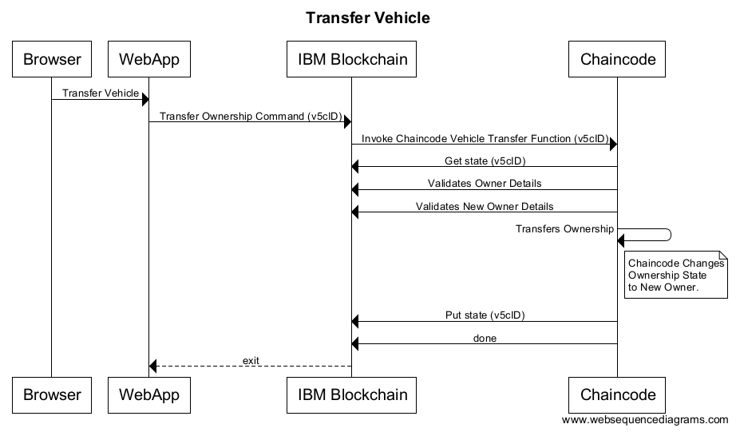

# Car Lease Demo

# Application Background

This application demonstrates the lifecycle of a vehicle from creation to manufacture, through a series of owners, and finishes with the vehicle being scrapped. The demo makes use of Node.js for the server side programming, with Golang used for the chaincode running on the IBM Blockchain network. The demo uses a single chaincodes. In this chaincode, the rules about what can and cannot happen to a vehicle are defined (similar to a v5c in the UK) and the chaincode uses JSON objects to store data about a vehicle. The application contains a 'ledger' view to allow users to see what has happened (e.g. a vehicle was transferred from person A to person B), this is done by querying each block in the blockchain and getting information about every transaction that has happened. 

Attributes of a vehicle:

	1.	V5cID            (unique string formed of two chars followed by a 7 digit int, used as the key to identify the vehicle)
	2. 	VIN              (15 digit int)
	3. 	Make             (String)
	4. 	Model            (String)
	5. 	Color            (String)
	6. 	Reg              (String)
	7. 	Owner            (Name of user)
	8. 	Scrapped         (Bool)
	9. 	Status           (int)
	10.	LeaseContractID  (ChaincodeID, currently unused but will store the id of the lease contract for the vehicle)

There is an API ([Documentation](/Documentation/API Methods.md)) that the client side uses to call the Node.js server. The Node.js server then uses HTTP REST calls to contact a peer on the IBM Blockchain network. The peer can then communicate with the blockchain and invoke the functionalities built into the chaincodes.

# Application Architecture

The demo was built using a 3 tier architecture. There is a Node JS server, which serves the web pages to the browser and also acts as the application server. The application server then interacts with the blockchain through the IBM Blockchain API. Below is a diagram of the application architecture:

# Use Case Walkthrough

## Transfer of Ownership ##

When a user sells their car the owner must be updated. The call is sent from the Web UI to transfer ownership of the vehicle. The Node.js code calls the Blockchain fabric using the REST API. This in turn invokes the function in the vehicle chaincode to transfer ownership of the car. It passes the V5cID of the vehicle to update, as well as the names of the caller and the recipient. The smart contract then makes a call to get the car before performing validation.

The validation checks that the name of the person causing the transfer is the same as that of the current owner, and that the caller is in a role where they have permission to transfer vehicles (the scrap merchant cannot). The validation also checks that the recipient is registered with the service, and that they are in the correct role for receiving the car (a dealership cannot receive an unfinished car).

The chaincode finds the roles and whether the users are registered by requesting the ecert (Enrollment Certificate) associated with their name from the CA (Certificate Authority). It does this using an HTTP REST call.

After the request is validated, the chaincode updates the owner attribute of the vehicle and writes the changes to the ledger.

To view the chaincode:

- [Vehicle Code](Chaincode/vehicle_code/vehicles.go)
